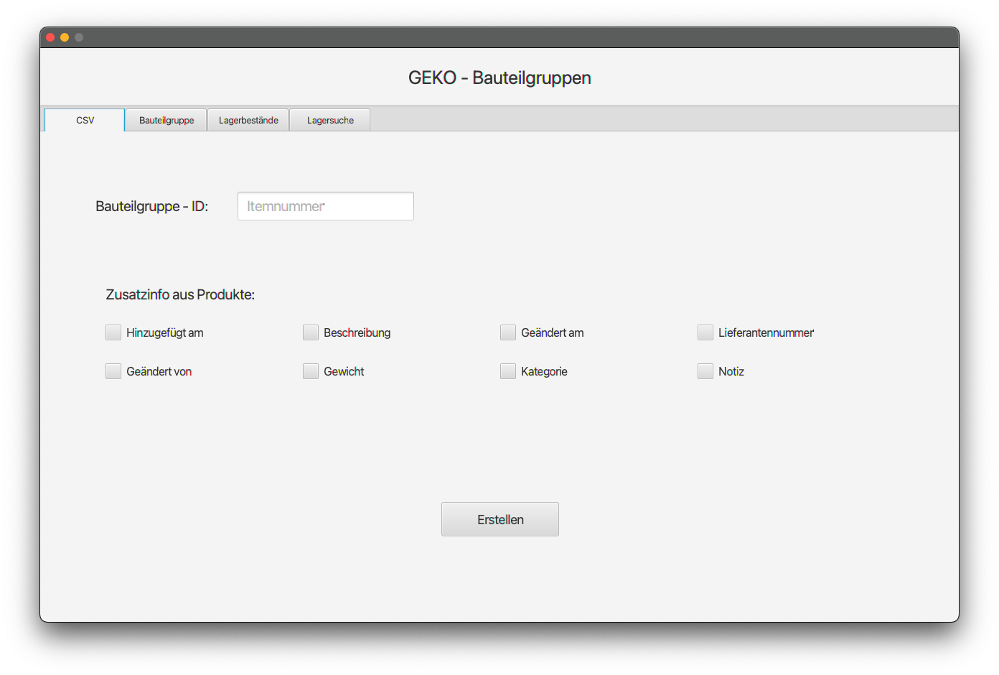
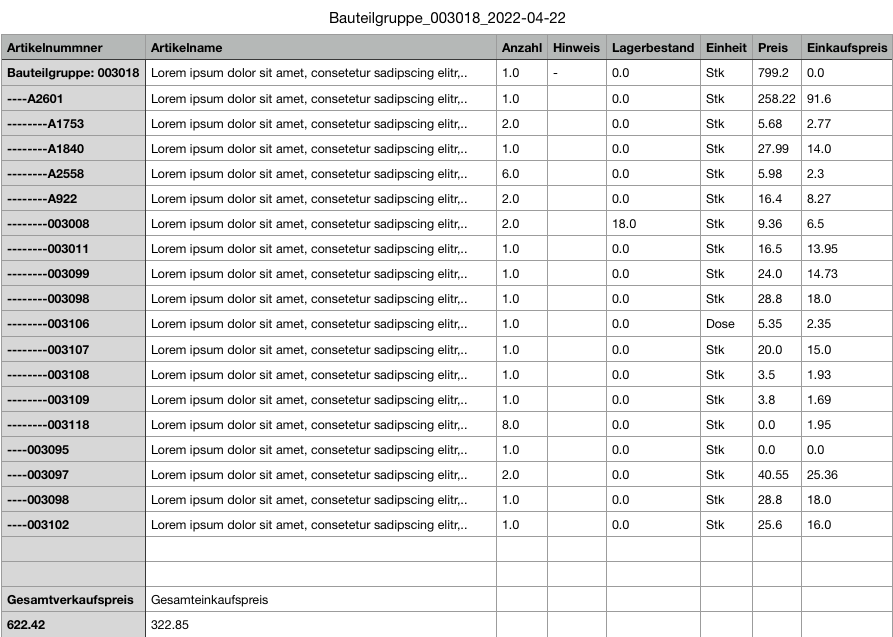

# Geko Article Management Software(GAMS)

**In cooperation with Geko Maschienenbau GmbH Sehnde.** https://www.geko-bau.de/geko-bau.html

**Conceptualized and developed by Ruwen Lamm.**

## Introduction

The Geko Article-Management-Software is a utility that provides the assignment of machine parts to the related machine. Therefore, a new machine can be constructed by assigning other existing components. The software enables the addition, deletion, modification and search of machine parts.

## Specification

The software is solely written in Java and operates on a MySQL Database. It also should be mentioned that GAMS is at this time only an addition/extension to the already existing product management software (Fakturama).

## Usage

### Generating a CSV file of machine parts

The machine ID must be entered in the text field above, additional information of the machine parts can be requested by checking the items below. If the machine does not exist an appropriate error message will be displayed.

By pressing the “Erstellen” button a CSV file of the corresponding machine parts is generated. If no additional information is requested only the default header will be posted (See fig. below). Since machine parts can be constructed by any number of other machine parts, a relation in form of a tree needs to be established. This is implemented by the indentation of the lines before the machine part ID in the first column.
(article/machine names are hidden for the reason of privacy)

### Adding, deleting and modifying machine parts

